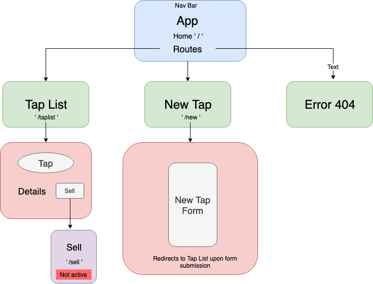

# _Brews and Barks_

#### _A web app for a brewery tap list, 15 Nov 2019_

#### By _**Christopher Burge**_

## Description

_This web application allows customers to view taproom beer choices and it will eventually allow employees to add and sell beer._

## Setup/Installation Requirements

* _Clone this repository_
* _Navigate to the main directory, "TapHouse"_
* _Run the command "$ npm install"_
* _Run the command "$ npm run start"_
* _Open the browser and navigate to "http://localhost:8080"_

  

## Technologies Used

_REACT, Webpack, Materialize.css_

### License

*Open-source*

Copyright (c) 2019 **_Christopher Burge_**